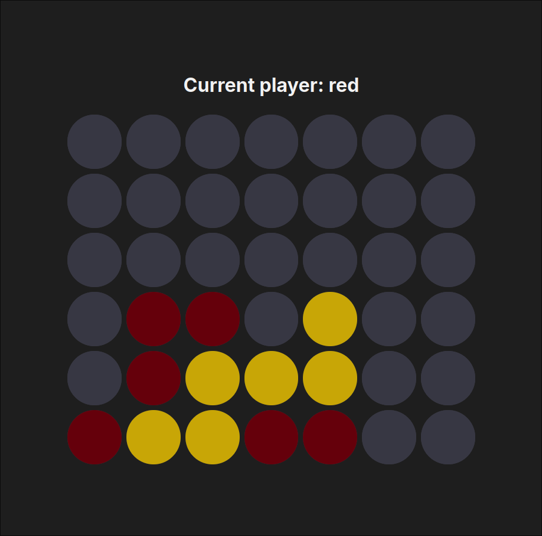

# Connect Four

## Rules

- The game is played on a 7x6 grid
- Players take turns dropping colored discs into the grid
- The discs fall straight down, occupying the next available space on the lowest row of the column they were dropped into
- The objective of the game is to be the first to form a horizontal, vertical, or diagonal line of four of one's own discs